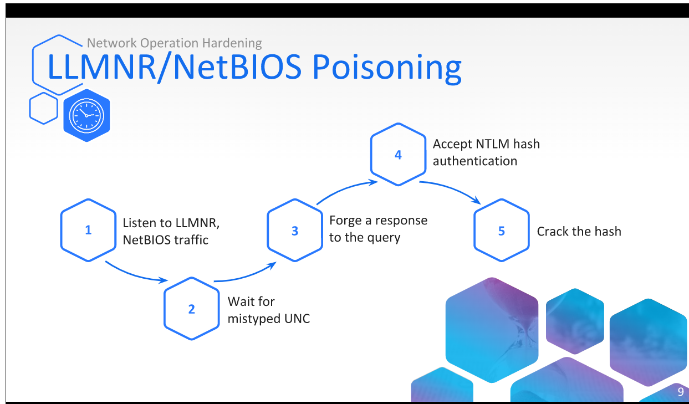

# Security Policies & Authentication

## Table of Contents

1. Network Operation Hardening 
2. Account Security Policies
3. Local Security Policies
4. Additional Security Measures
5. NTLM Authentication
6. Kerberos Authentication

 # Network Operation Hardening 

 ## Legacy Technologies

 * Windows systems use many technologies, including older legacy protocols and services. This poses a potential security concern. Some should be disabled

 * Microsoft windows supports legacy technolgoies that have been associated w/ security breaches.

 ## Name Resolution Technologies

 * **LLMNR** used when DNS cannot provide name resolution using multicast, this is by default will send a multicast to try to find the DNS.

 * **NetBIOS** used when llmnr cannt provide name resolution, uses broadcasts, whereby each computer can respond.
 
 * there is no need for these legacy technolgoies as we now have DNS.

## Disabling LLMNR

* LLMNR is turned on by default in computers, computer policy can be activated to disable it, the policy is called **turned off multicast name resolution** 

## Disabling NetBIOS

* NetBios is available by default on microsfot computers, its settings can be controlled from the ethernet adapter advanced IPv4 properties. Instead of Default, it should be set to disable.

## SMB Relay

## SMB Signing

* SMB is commonly used on Windows systems.
* Provides digital signatures for packets
* Available in all windows versions since 2000
* Enabled by default **only in DCs**

## SMB Signing: GPO

SMB signing can be configured via a policy that all clients in the domain should apply.

# Account Security Policies

## Account Security Measures

* **Administrator User** : Should be disabled in the system to provent brute-force attempts
* **Privileged Accounts** : Avoid assigning privileged accounts for users.
* **Password Policy** : A policy must be configured to enforce strong passwords.

## Disabling Administrators
* Only a user with administrative privileges can disable the administrator account
* In a domain environment this is done via AD Users and Computers ADUC
* In the local environment, it is done via edit local users and groups

## Privileged Accounts
* Privileged accounts should be used instead of administrator accounts.
* The accounts should be provided only to users who require them.
* The accounts will be added to the administrators or domain admin groups.

## Password Policy

* Account passwords should be complex
* Domain environments require strong passwords with at least seven characters.
* An independent station does not require a password.

## Account Policy

* Under Password policy is the account lockout policy
* It determines after how many log-in attempts an account will be locked.
* It also provides an option to set a time limit for the lockout.

# Local Security Policies & Authentication

## Local Policies
* Local policies store permissions and restrictions associated w/ the station
* they also manage logging options, allowed user actions , and other security settings.

## Access Policies
* Deny or permit access (communication) to computer via the network
*determine who can access a computer.
* Does not apply to remote desktop ( RDP ) which are managed via separate policies

## Local Logon Policies

* Deny or permit local logon
* Determine which users can log on to a computer
* Deny policies override allow policies

## Rename Administrator

**Accounts:Rename administrator account** 
* Enables changing an administrator account name
* used to protect against discovery of an administrators account

## Display Last User

**Interactive logon: Do not display last user name**
* Used to disable the display of the last logged-on user.

## Audit Policies
* Audit is a method of applying user activity log options
* Logging data is essential for monitoring and security purposes.

# Additional Security Measures
**Disable IPv6, if you aint using it, disable it!**
## Security Maintenance
this removes our attack surface
* **Service Management** : Disable or uninstall unused services.
* **User Management** : Disable or delete inactive users.
* **Maintenance** Install Microsoft's latest service packs and hot fixes.

## Physical Access Security 
* **BIOS Password** : Password-protect access to the BIOS.
* **Recovery Console** : Disable automatic administrative logon to the recovery console.
* **System Boot** : Prevent unauthorized booting from alternate media.

## System Data Security

* **EFS ( ENcryption File System )** : Provides protection for files and directories
* **BitLocker**: Provides full disk encryption instead of only for specific Files.
* **File Sharing** : Plan for the sharing of resources on the network by settings proper access permissions.

# NTLM Authentication

## NTLM Overview

* Windows challenge-response authentication protocol
* Provides a secure authentication process
* Use the hash value of the user's password

## When is NTLM Used?

* When the client is a member of a workgroup (P2P)
* When the client authenticates to a server via an IP address
* When the client authenticates to a different domain ( trust relationship)
* When Kerberos is unsupported by a system or when Kerberos is not available

## NTLM Process

Illustration of NTLM authentication between a client and a DC server.

## Pass the Hash

* Authentication by hash
* When available, there is no need to brute-force because the hash can be extracted.

* SAM: Security Account Manager
* Database file that stores user password hashes for local authentiocation

LSASS verifies the authenticity of user via SAM and NTDS.dit when they log in to the system.

## LSASS

* LSASS: Local Security Authority Subsystem Service
* Manages user authentication
* Manages password changes
* Creates access tokens

# Kerberos Authentication

## Kerberos Overview

* Client-server authentication method
* Clients receive tickets from the KDC ( Key Distribution Center)  for authentication
* Tickets represent user network credentials
* By default, Kerberos uses port TCP 88.

## Kerberos Process

Illustration of the Kerberos process when accessing a shared resource

## Pass the Ticket

* Authentication via a  ticket
* Authentication w/ a ticket poses a risk of Pass the Ticket ( PtT) attacks

* PtT is malicious activity, identified by unusual remote connection or suspicious activity noticed in the Event Viewer

